# 📘 Actividad de Evaluación: Funciones SQL

**Nombre:** Gustavo Martinez Guerra 
**Matrícula:** 21301268
**Materia:** Inteligencia de negocios 
**Fecha:** 9 de octubre de 2025  

---

## 🎯 Objetivo

El alumno elaborará un documento que contenga teoría, sintaxis, ejemplos y resultados de ejecución sobre las siguientes funciones SQL:

- Funciones de cadenas  
- Funciones de fechas  
- Control de valores nulos  
- Uso de MERGE  
- Uso de CASE  

---

## 🧩 1. Funciones de Cadenas

### 📖 Teoría

Las **funciones de cadenas** permiten manipular y transformar valores de texto. Se utilizan para concatenar, extraer, reemplazar o convertir texto dentro de una consulta SQL.

Algunas funciones comunes son:
- `LEN()` → devuelve la longitud de una cadena.
- `UPPER()` y `LOWER()` → convierten texto a mayúsculas o minúsculas.
- `SUBSTRING()` → extrae una parte específica del texto.
- `REPLACE()` → sustituye un fragmento de texto por otro.

### 💻 Sintaxis

- Longitud de una cadena

```sql

SELECT LEN('SQL Server');
```
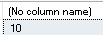

- Convertir a mayúsculas
```sql

SELECT UPPER('cadena de texto');
```
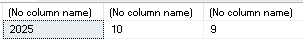

- Extraer parte del texto
```sql

SELECT SUBSTRING('Programación', 1, 7);
```
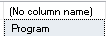

- Reemplazar texto

```sql
SELECT REPLACE('Hola Mundo', 'Mundo', 'SQL');
```
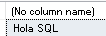

### 🧪 Ejemplo practico

```sql

SELECT 
    FirstName,
    UPPER(LastName) AS ApellidoMayuscula,
    LEN(FirstName) AS LongitudNombre
FROM Employees;

```
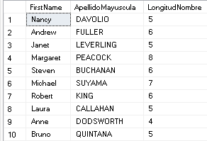

## 2. Funciones de Fechas

### Teoría

Las funciones de fecha permiten manipular valores de tipo datetime, obteniendo partes específicas (día, mes, año) o realizando cálculos con fechas.

Funciones más comunes:

GETDATE() → devuelve la fecha y hora actual del sistema.

YEAR(), MONTH(), DAY() → extraen partes de la fecha.

DATEADD() → suma o resta intervalos a una fecha.

DATEDIFF() → calcula la diferencia entre dos fechas.

### 💻 Sintaxis

- Fecha y hora actual
```sql
SELECT GETDATE();
```
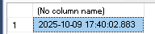

- Extraer año, mes y día
```sql
SELECT YEAR(GETDATE()), MONTH(GETDATE()), DAY(GETDATE());
```
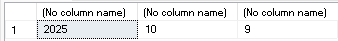

- Sumar días a una fecha
```sql
SELECT DATEADD(DAY, 10, '2025-10-09');
```
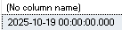

- Diferencia en días entre dos fechas
```sql
SELECT DATEDIFF(DAY, '2025-01-01', GETDATE());
```
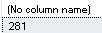

### 🧪 Ejemplo practico

```sql
SELECT 
    OrderID,
    OrderDate,
    DATEDIFF(DAY, OrderDate, GETDATE()) AS DiasTranscurridos
FROM Orders;
```
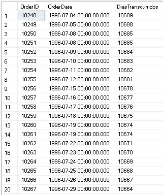

---

## 🚫 3. Control de Valores Nulos

### 📖 Teoría

Los valores NULL representan datos desconocidos o inexistentes. SQL Server ofrece funciones para tratarlos y evitar errores en operaciones o resultados.

Funciones principales:

ISNULL(valor, reemplazo) → reemplaza un valor nulo por otro.

COALESCE(valor1, valor2, ...) → devuelve el primer valor no nulo.

### 💻 Sintaxis

- Reemplazar NULL por un valor
```sql
SELECT 
    CategoryID,
    CategoryName,
    ISNULL(Description, 'Sin descripción') AS Descripcion
FROM Categories;
```
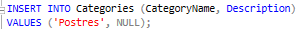
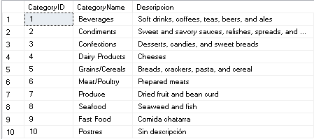

- Devolver el primer valor no nulo
```sql
SELECT COALESCE(NULL, NULL, 'Valor por defecto');
```
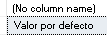

### 🧪 Ejemplo Práctico

```sql
SELECT 
    CustomerID,
    ISNULL(Region, 'No especificada') AS Region
FROM Customers;
```
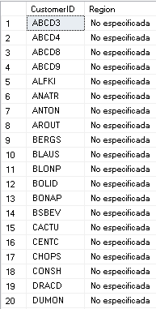
---
## 🔁 4. Uso de MERGE
### 📖 Teoría

La instrucción MERGE permite realizar operaciones INSERT, UPDATE o DELETE en una sola sentencia, dependiendo de si los registros coinciden o no entre dos tablas.

Es útil para sincronizar datos entre tablas.

### 💻 Sintaxis

```sql
MERGE TablaDestino AS D
USING TablaOrigen AS O
ON D.ID = O.ID
WHEN MATCHED THEN
    UPDATE SET D.Campo = O.Campo
WHEN NOT MATCHED THEN
    INSERT (ID, Campo) VALUES (O.ID, O.Campo)
WHEN NOT MATCHED BY SOURCE THEN
    DELETE;
```

### 🧪 Ejemplo Práctico

- Actualizar/insertar algunos productos por NOMBRE

```sql
MERGE dbo.Products AS D
USING (VALUES
  ('Chai', 22.00, 0),      -- ProductName, UnitPrice, Discontinued
  ('Tofu', 18.50, 0)
) AS O(ProductName, UnitPrice, Discontinued)
ON D.ProductName = O.ProductName
WHEN MATCHED THEN
  UPDATE SET D.UnitPrice = O.UnitPrice,
             D.Discontinued = O.Discontinued
WHEN NOT MATCHED BY TARGET THEN
  INSERT (ProductName, SupplierID, CategoryID, QuantityPerUnit, UnitPrice,
          UnitsInStock, UnitsOnOrder, ReorderLevel, Discontinued)
  VALUES (O.ProductName, 1, 1, '1 box', O.UnitPrice, 0, 0, 0, O.Discontinued);

```
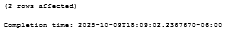

``` sql
  SELECT ProductID, ProductName, UnitPrice, Discontinued
FROM Products
WHERE ProductName IN ('Chai', 'Tofu');      
```
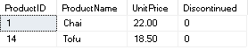

---
## ⚙️ 5. Uso de CASE
### 📖 Teoría

La instrucción CASE permite realizar evaluaciones condicionales dentro de una consulta SQL. Es similar a una estructura if...else en otros lenguajes.

Se usa comúnmente para clasificar datos o mostrar resultados personalizados.

### 💻 Sintaxis

```sql
SELECT 
    columna,
    CASE 
        WHEN condición1 THEN resultado1
        WHEN condición2 THEN resultado2
        ELSE resultado_por_defecto
    END AS NuevaColumna
FROM tabla;
pendiente 2
```

### 🧪 Ejemplo Práctico
- Clasifica cada producto como Barato / Medio / Caro.
```sql
SELECT 
    ProductID,
    ProductName,
    UnitPrice,
    CASE 
        WHEN UnitPrice < 20 THEN 'Barato'
        WHEN UnitPrice BETWEEN 20 AND 50 THEN 'Medio'
        ELSE 'Caro'
    END AS RangoPrecio
FROM Products;
```
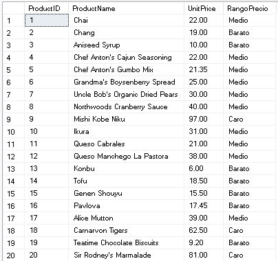
## ✅ Conclusión

Las funciones SQL permiten manipular y analizar datos de forma eficiente.
Cada tipo (cadenas, fechas, control de nulos, MERGE y CASE) amplía la capacidad de SQL Server para resolver problemas reales en el manejo de información empresarial.

---

## 📅 Elaborado por:
Gustavo Martinez Guerra - 
UTTT – Ingeniería en Entornos Virtuales y Negocios Digitales

